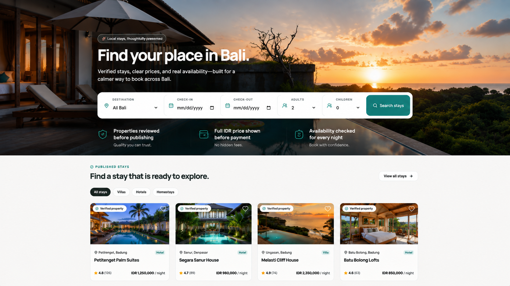

# StayBali

An accommodation booking platform for discovering and managing villas, hotels, and homestays across Bali.

StayBali is an English-first MVP that brings travelers, accommodation partners, and administrators into one booking workflow—from property discovery and availability search to quotes, inventory holds, and booking management.



## Project status

The project is under active development. The foundation, supply management, and discovery milestones are complete; the booking milestone is currently in progress.

| Milestone | Status | Scope |
| --- | --- | --- |
| Foundation | Complete | Authentication, role-based access, audit logs, partner lifecycle |
| Supply | Complete | Property and room management, approval workflow, media lifecycle |
| Discovery | Complete | Inventory, paginated search, availability, expiring quotes |
| Booking | Nearly complete | Inventory holds, booking snapshots, checkout, expiry |
| Payment | Complete | Local demo adapter, retry, confirmation, history, vouchers |
| Operations | In progress | Stay controls, cancellation/refund, transactional email queue |

See [Project Progress](./docs/PROGRESS.md) for the latest implementation notes and remaining work.

## Key features

- Public property discovery with date and guest filters
- Property detail, room availability, and server-side price quotes
- Credential-based authentication with Admin, Partner, and Traveler roles
- Partner onboarding and account approval
- Property, room type, facility, inventory, and media management
- Admin review and property publication workflow
- Secure local media storage with generated image variants
- Expiring quotes, temporary inventory holds, and booking snapshots
- Manual reservations and scoped booking operations for Partners and Admins
- Audit trails, status histories, idempotency, and transactional domain services
- Transactional email outbox, BullMQ retry worker, and Admin failure visibility

## Technology stack

| Area | Technology |
| --- | --- |
| Framework | Next.js 16, React 19, TypeScript |
| Styling | Tailwind CSS 4 |
| Database | PostgreSQL, Prisma 7 |
| Authentication | Auth.js / NextAuth 5 |
| Validation | Zod 4 |
| Motion and icons | Framer Motion, Lucide React |
| Image processing | Sharp |
| Jobs and email | Redis, BullMQ, Nodemailer |
| Testing | Node.js test runner via TSX |

## Getting started

### Prerequisites

- Node.js 24 or later
- npm
- PostgreSQL
- Redis (required when running the notification worker)

### 1. Install dependencies

```bash
npm install
```

### 2. Configure the environment

Create a local environment file from the provided template:

```bash
# macOS or Linux
cp .env.example .env

# Windows PowerShell
Copy-Item .env.example .env
```

Update the values in `.env` for your local PostgreSQL instance. Generate a strong `AUTH_SECRET`, for example with:

```bash
node -e "console.log(require('crypto').randomBytes(32).toString('base64'))"
```

| Variable | Purpose |
| --- | --- |
| `DATABASE_URL` | Application PostgreSQL connection string |
| `SHADOW_DATABASE_URL` | Shadow database used by Prisma migrations |
| `AUTH_SECRET` | Secret used to encrypt and sign authentication data |
| `ADMIN_SEED_PASSWORD` | Password for the seeded Admin account |
| `PARTNER_SEED_PASSWORD` | Password shared by seeded Partner accounts |
| `TRAVELER_SEED_PASSWORD` | Password for the seeded Traveler account |
| `MEDIA_STORAGE_ROOT` | Local directory for uploaded media |
| `REDIS_URL` | Redis connection used by BullMQ |
| `EMAIL_TRANSPORT` | `sink` for local preview or `smtp` for external delivery |
| `APP_URL` | Public application URL used in email links |
| `EMAIL_FROM`, `SMTP_*` | Sender and SMTP settings when transport is `smtp` |

Never commit `.env` or use the example credentials in a shared environment.

### 3. Prepare the database

```bash
npm run db:generate
npm run db:deploy
npm run db:seed
```

The seed creates one Admin, one Traveler, three active Partner accounts, and sample Bali properties. The account passwords are taken from your `.env` file.

| Role | Seeded email |
| --- | --- |
| Admin | `admin@staybali.test` |
| Traveler | `traveler@staybali.test` |
| Partner | `partner1@staybali.test` through `partner3@staybali.test` |

### 4. Start the application

```bash
npm run dev
```

Open [http://localhost:3000](http://localhost:3000) in your browser.

Run the email worker in a second process when Redis is available:

```bash
npm run worker:email
```

The default `sink` transport processes messages without external delivery. Set `EMAIL_TRANSPORT=smtp` and configure the documented SMTP variables only in the deployment environment to send email.

## Available commands

| Command | Description |
| --- | --- |
| `npm run dev` | Start the development server |
| `npm run build` | Create a production build |
| `npm run start` | Run the production server |
| `npm run lint` | Run ESLint |
| `npm test` | Run domain policy and workflow tests |
| `npm run test:integration` | Run PostgreSQL concurrency tests |
| `npm run db:generate` | Generate the Prisma client |
| `npm run db:validate` | Validate the Prisma schema |
| `npm run db:migrate` | Create and apply a development migration |
| `npm run db:deploy` | Apply committed migrations |
| `npm run db:status` | Check the migration state |
| `npm run db:seed` | Recreate development seed data |
| `npm run db:studio` | Open Prisma Studio |
| `npm run media:cleanup` | Preview orphaned media cleanup |
| `npm run media:cleanup -- --execute` | Delete confirmed orphaned media |
| `npm run reservations:cleanup` | Expire stale holds and payment bookings |
| `npm run notifications:dispatch` | Dispatch a single batch of pending email events |
| `npm run worker:email` | Run the email outbox dispatcher and BullMQ worker |

## Project structure

```text
stay-bali/
├── app/          # Routes, layouts, server actions, and API handlers
├── components/   # UI grouped by product area
├── docs/         # Product, architecture, and implementation documents
├── lib/          # Domain services, policies, validation, and data access
├── prisma/       # Database schema, migrations, and development seed
├── public/       # Static assets
├── scripts/      # Operational and maintenance scripts
├── worker/       # Long-running BullMQ processors and dispatchers
└── types/        # Shared TypeScript declarations
```

Domain mutations live in server-only service modules under `lib/`. Critical inventory and booking operations use database transactions, while authorization is derived from the authenticated session rather than client input.

## Quality checks

Run the full local verification suite before opening a pull request:

```bash
npm run lint
npm test
npm run test:integration
npx tsc --noEmit
npm run db:validate
npm run build
```

Database-backed flows also require an up-to-date local PostgreSQL database:

```bash
npm run db:status
```

## Documentation

- [Product Requirements](./docs/PRD_MVP_Property_Booking.md) — product scope and MVP boundaries
- [Functional Requirements](./docs/REQUIREMENTS_MVP_Property_Booking.md) — workflows and business invariants
- [Architecture](./docs/ARCHITECTURE_MVP_Property_Booking.md) — technical boundaries and design decisions
- [MVP Roadmap](./docs/ROADMAP_MVP_Property_Booking.md) — milestone breakdown
- [Database Foundation](./docs/DATABASE_FOUNDATION.md) — data model and database constraints
- [Authentication](./docs/AUTHENTICATION.md) — sign-in flow and security rules
- [Supply Workflow](./docs/SUPPLY_WORKFLOW.md) — property, media, inventory, and approval flows
- [Project Progress](./docs/PROGRESS.md) — current status and handoff notes

## Security notes

- Keep database credentials, seed passwords, and `AUTH_SECRET` outside version control.
- Replace all development credentials before deploying to a shared environment.
- Uploaded media is served through controlled application routes rather than directly exposing the storage directory.
- Payment uses a local portfolio demo adapter only; do not use it for real transactions.

## Contributing

Keep changes focused, include tests for domain rules, and update the relevant documentation when behavior or architecture changes. Database changes must include a committed Prisma migration.

This repository is currently private and has no open-source license.
