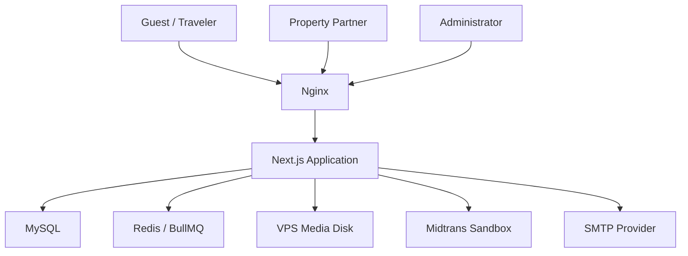
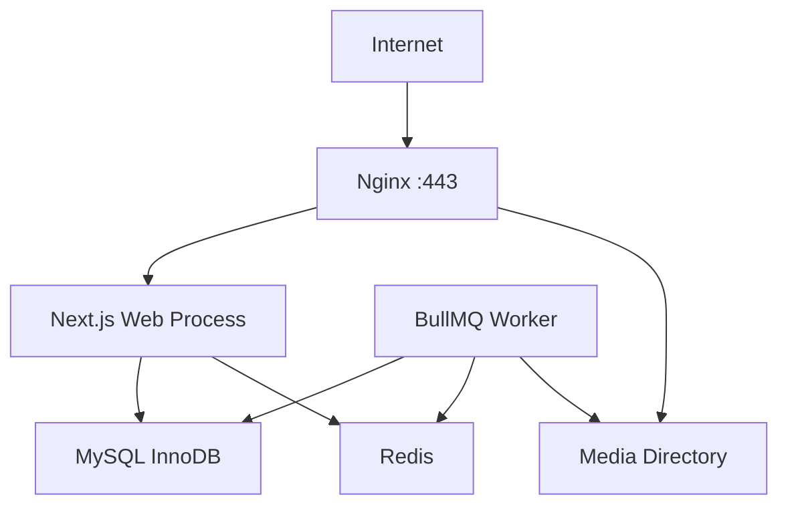
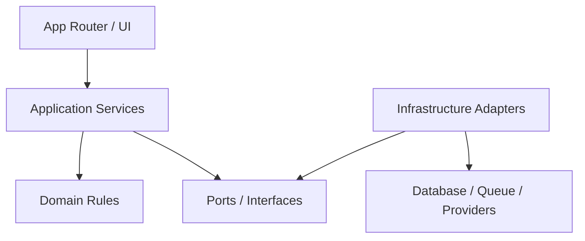
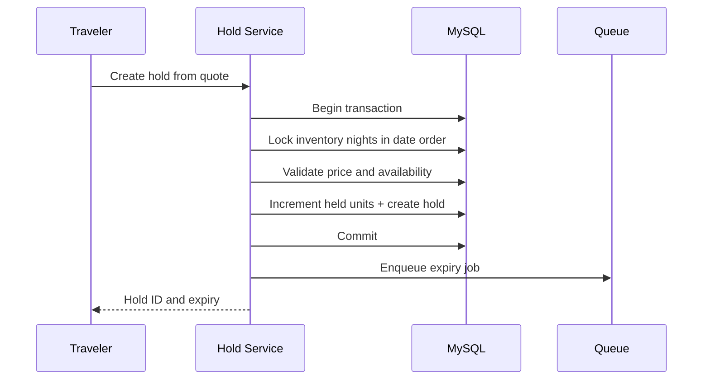
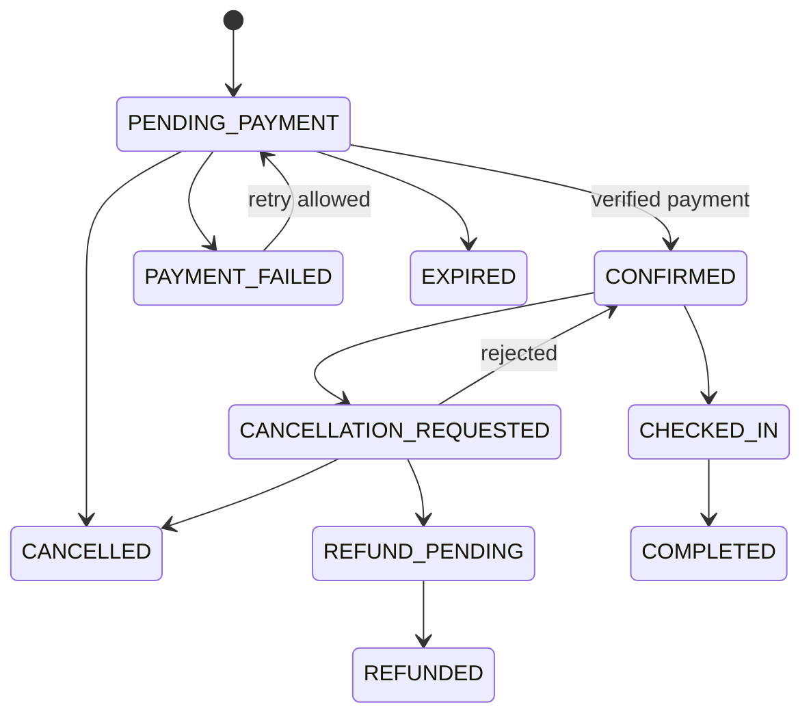
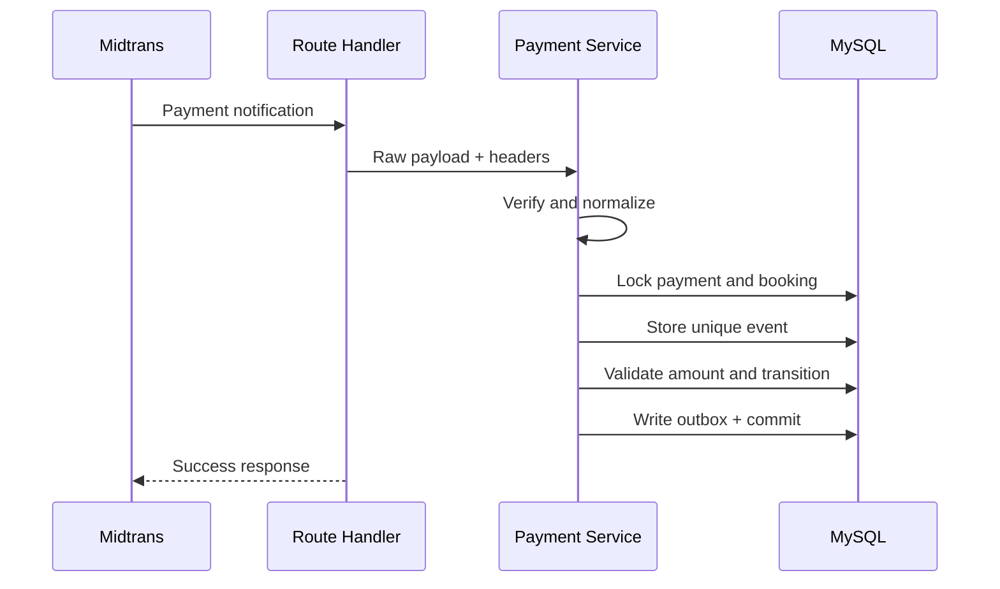

# Software Architecture Document

## StayBali — Platform Booking Akomodasi Lokal MVP

**Status:** Draft v1.0  
**Tanggal:** 28 Agustus 2026  
**Pemilik:** Solo Developer  
**Dokumen sumber:** `PRD_MVP_Property_Booking.md`, `REQUIREMENTS_MVP_Property_Booking.md`, dan `ROADMAP_MVP_Property_Booking.md`  
**Architecture style:** Full-stack modular monolith  
**Deployment target:** Satu VPS production  

---

## 1. Tujuan Dokumen

Dokumen ini menentukan struktur teknis StayBali agar seluruh requirement MVP dapat dibangun oleh solo developer tanpa mengadopsi kompleksitas infrastruktur OTA besar.

Arsitektur harus cukup kuat untuk menangani:

- Tiga role dan ownership isolation.
- Property approval workflow.
- Inventory dan harga per tanggal.
- Quote dan temporary hold.
- Pencegahan double booking.
- Booking state machine.
- Payment webhook yang idempotent.
- Reservasi online dan manual pada inventory yang sama.
- Background job dan email.
- Media pada local/VPS storage.

Arsitektur tidak ditujukan untuk high availability, multi-region, jutaan request, atau integrasi banyak supplier.

---

## 2. Architecture Drivers

Keputusan teknis diprioritaskan berdasarkan urutan berikut:

1. **Correctness:** inventory, booking, dan payment tidak boleh menghasilkan state yang salah.
2. **Security:** Partner hanya dapat mengakses data miliknya dan Traveler hanya booking miliknya.
3. **Maintainability:** satu codebase dengan batas modul yang jelas.
4. **Solo-developer operability:** dapat dijalankan, dipantau, di-backup, dan diperbaiki oleh satu orang.
5. **Portfolio depth:** menunjukkan transaksi, locking, idempotency, worker, adapter, audit, dan testing.
6. **Infrastructure cost:** cukup satu VPS, MySQL, Redis, dan disk lokal.
7. **Future migration:** payment dan media dapat diganti tanpa mengubah business logic.

---

## 3. Architecture Decision Summary

| Area | Keputusan | Alasan |
|---|---|---|
| Application | Next.js App Router + TypeScript | Satu full-stack codebase dengan rendering, server mutation, dan HTTP endpoint |
| Architecture | Modular monolith | Batas domain jelas tanpa overhead microservices |
| UI foundation | shadcn/ui + Tailwind CSS | Source component dapat dimiliki dan dikustomisasi; cepat untuk solo dev |
| Theme | CSS variables/design tokens | Memisahkan karakter visual StayBali dari default component |
| Validation | Zod pada application boundary | Schema validation yang dapat dipakai form dan server |
| Authentication | Auth.js Credentials + JWT session | Integrasi Next.js dan login email/password yang realistis untuk MVP |
| Authorization | Server-side role + ownership policies | Mencegah horizontal/vertical privilege escalation |
| ORM | Prisma ORM | Migration, typed query, seed, dan developer experience |
| Database | MySQL 8+ dengan InnoDB | Sesuai stack developer dan mendukung transaction/row locking |
| Concurrency | Transaction + ordered `SELECT ... FOR UPDATE` | Mencegah dua proses mengambil unit terakhir |
| Queue | BullMQ | Delayed/retryable jobs dan worker terpisah |
| Queue store | Redis | Dependency BullMQ dan cache/locking non-authoritative bila diperlukan |
| Payment | Midtrans Snap Sandbox melalui adapter | Mendemonstrasikan checkout dan webhook Indonesia |
| Email | SMTP provider melalui email adapter | Provider dapat diganti dan failure tidak mengubah booking |
| Media | Local filesystem adapter + Sharp | Realistis di local/VPS, tetap dapat dimigrasikan ke object storage |
| Reverse proxy | Nginx | TLS termination, reverse proxy, media/static caching |
| Runtime | Node.js LTS | Runtime resmi untuk self-hosted Next.js dan worker |
| Process | systemd services | Menjalankan web dan worker tanpa wajib Docker/Kubernetes |
| Observability | Structured logs + health checks | Cukup ringan untuk satu VPS |

Versi package tidak dikunci di dokumen arsitektur. Versi stable yang kompatibel dipilih saat project initialization dan dikunci melalui lockfile.

---

## 4. System Context



### System boundary

Di dalam tanggung jawab StayBali:

- Web UI dan server-side rendering.
- Authentication dan authorization.
- Property, room, inventory, quote, hold, dan booking rules.
- Payment attempt dan webhook processing.
- Worker, email orchestration, audit, dan media lifecycle.

Di luar tanggung jawab StayBali:

- Keberhasilan jaringan payment provider.
- Pengiriman akhir email oleh provider.
- Refund dana nyata.
- Sinkronisasi inventory OTA eksternal.

---

## 5. Runtime dan Deployment View



### Runtime processes

| Process | Responsibility | Scale MVP |
|---|---|---:|
| Nginx | HTTPS, reverse proxy, upload limit, media/static cache | 1 |
| Next.js web | UI, Server Components, Server Actions, Route Handlers | 1 |
| BullMQ worker | Email, expiry, outbox dispatch, media cleanup | 1 |
| MySQL | Authoritative transactional data | 1 |
| Redis | BullMQ queue state dan delayed jobs | 1 |

Semua komponen dapat berjalan pada satu VPS. MySQL dan Redis dapat dipindahkan ke managed service nanti tanpa mengubah modular boundary.

### VPS directory concept

```text
/srv/staybali/app/releases/       application releases
/srv/staybali/app/current/        active release symlink
/var/lib/staybali/media/          persistent original/display/thumbnail files
/var/backups/staybali/            database and media backups
/var/log/staybali/                optional application-managed logs
```

Media dan backup tidak disimpan di dalam folder release agar tidak hilang saat deploy.

---

## 6. Next.js Application Boundary

### 6.1 App Router

Next.js App Router digunakan untuk seluruh halaman public, Traveler, Partner, dan Admin.

Route groups konseptual:

```text
app/
├── (public)/
├── (auth)/
├── account/
├── partner/
├── admin/
└── api/
```

Route group hanya mengatur URL/layout. Business module tidak ditempatkan langsung di folder page.

### 6.2 Server dan Client Components

- Server Component menjadi default untuk page dan data read.
- Client Component hanya digunakan ketika membutuhkan browser state, event handler, interactive calendar, dialog, uploader, atau optimistic feedback.
- Data sensitif dan database client tidak pernah di-import ke Client Component.
- Props dari server ke client menggunakan DTO minimal, bukan seluruh database record.
- Komponen client tidak menjadi tempat business rule booking atau authorization.

### 6.3 Data mutation

Gunakan dua jalur:

1. **Server Actions/Server Functions** untuk form mutation internal dari UI StayBali.
2. **Route Handlers** untuk boundary HTTP yang nyata: payment webhook, health check, media delivery bila diperlukan, dan endpoint yang dikonsumsi client secara asynchronous.

Server Action dan Route Handler wajib memanggil application service yang sama. Keduanya tidak boleh menggandakan aturan domain.

### 6.4 Data read

- Server Component memanggil query/application service langsung.
- Server Component tidak melakukan HTTP request ke Route Handler milik aplikasi sendiri.
- Client-side request hanya untuk interaksi yang memang membutuhkan update tanpa navigasi penuh, seperti inventory calendar dan countdown/status refresh.
- Query publik mengembalikan public DTO; query dashboard memakai DTO berbeda.

### 6.5 Caching policy

| Data | Policy |
|---|---|
| Public property metadata | Dapat di-cache dengan revalidation/tag invalidation |
| Facility/location master | Dapat di-cache |
| Availability | Dynamic, tidak menggunakan stale shared cache |
| Quote | Tidak di-cache; memiliki expiry sendiri |
| Hold | Tidak di-cache |
| Booking/payment | Tidak di-cache |
| Dashboard metrics | Dynamic atau short-lived private cache bila dibutuhkan |

Cache tidak pernah menjadi sumber kebenaran availability.

---

## 7. UI Architecture dan shadcn/ui

### 7.1 Keputusan penggunaan

shadcn/ui digunakan sebagai source-code foundation, bukan sebagai desain akhir dan bukan sebagai external black-box component library.

Komponen yang diambil masuk ke codebase dan boleh dimodifikasi sesuai kebutuhan StayBali. Hal ini cocok untuk portfolio karena developer tetap memahami markup, accessibility, variant, dan styling component.

### 7.2 Layer komponen

| Layer | Contoh | Rule |
|---|---|---|
| Primitive/UI | Button, Input, Dialog, Sheet, Table | Berasal dari shadcn dan tidak mengetahui domain |
| Shared composition | PageHeader, DataTable, EmptyState, MoneyDisplay | Dipakai lintasmodul |
| Domain component | PropertyCard, RoomRateCard, BookingStatusBadge | Memahami DTO domain tetapi tidak menjalankan business rule |
| Feature container | SearchForm, InventoryCalendar, CheckoutForm | Mengatur interaction dan memanggil server boundary |
| Route/page | Search page, Partner property page | Composition, metadata, dan access gate |

### 7.3 Design token boundary

CSS variables digunakan untuk:

- Color semantic: background, surface, primary, accent, destructive, success, warning.
- Typography scale.
- Radius.
- Spacing tambahan bila diperlukan.
- Shadow dan border.

Nilai final ditentukan di `DESIGN_SYSTEM.md`. Komponen tidak boleh menyebarkan hardcoded brand color secara acak.

### 7.4 Component policy

- Hanya tambahkan component shadcn yang digunakan.
- Review source component setelah ditambahkan.
- Jangan mengedit primitive untuk satu halaman jika perubahan seharusnya menjadi variant.
- Domain-specific state menggunakan domain component, bukan menambahkannya ke generic Button/Table.
- Loading, error, empty, disabled, focus, dan mobile state wajib dirancang.
- Dark mode bukan P0 kecuali disepakati pada Design System.

---

## 8. Modular Monolith Design



### 8.1 Module boundaries

| Module | Responsibility | Tidak boleh bertanggung jawab atas |
|---|---|---|
| Identity | User, login support, account status | Property ownership rules |
| Partner | Partner lifecycle dan ownership resolution | Public search |
| Property | Property, room, facility, approval | Booking/payment state |
| Media | Upload, variant, reference, deletion | Property approval decision |
| Inventory | Inventory dates, price override, availability | Payment |
| Quote | Price breakdown dan expiry | Inventory reservation |
| Hold | Temporary reservation dan expiry | Payment confirmation |
| Booking | Booking snapshot dan state machine | Provider-specific status parsing |
| Payment | Attempts, provider adapter, webhook mapping | Property CRUD |
| Cancellation | Request, eligibility, refund record | Provider refund P0 |
| Notification | Email template/event handling | Booking transaction ownership |
| Reporting | Dashboard read models/aggregation | Transactional write rule |
| Audit | Immutable sensitive-action record | Business transition decision |

### 8.2 Dependency rules

- UI bergantung pada application services, bukan langsung pada Prisma.
- Application services mengorkestrasi domain rule dan repository/adapter.
- Domain rule tidak mengimpor Next.js, Prisma, BullMQ, Midtrans SDK, filesystem, atau email library.
- Infrastructure mengimplementasikan repository/port.
- Satu module boleh menggunakan public service module lain, tetapi tidak membaca tabel internal module lain secara acak untuk write operation.
- Reporting boleh melakukan optimized read query lintasmodule karena bersifat read-only.
- Circular dependency antar-module tidak diperbolehkan.

### 8.3 Pragmatic boundary

MVP tidak memerlukan entity framework atau abstraction berlapis untuk setiap CRUD. Repository abstraction diwajibkan hanya pada boundary yang bernilai:

- Payment provider.
- Media storage.
- Email provider.
- Queue/outbox dispatcher.
- Transactional booking/inventory operations.

CRUD sederhana boleh menggunakan Prisma di infrastructure/application layer selama tidak bocor ke UI dan tidak menduplikasi domain rule.

---

## 9. Suggested Source Structure

```text
src/
├── app/                         Next.js routes and layouts
├── components/
│   ├── ui/                      shadcn primitives
│   ├── shared/                  cross-domain compositions
│   └── domain/                  property, booking, payment UI
├── modules/
│   ├── identity/
│   ├── partner/
│   ├── property/
│   ├── media/
│   ├── inventory/
│   ├── quote/
│   ├── hold/
│   ├── booking/
│   ├── payment/
│   ├── cancellation/
│   ├── notification/
│   ├── reporting/
│   └── audit/
├── infrastructure/
│   ├── database/
│   ├── queue/
│   ├── storage/
│   ├── payment/
│   ├── email/
│   └── observability/
├── lib/                         framework-level utilities
├── config/                      validated environment config
└── types/                       truly shared TypeScript types

prisma/
├── schema.prisma
├── migrations/
└── seed/

worker/
├── index.ts
├── processors/
└── schedulers/
```

Struktur internal module yang dianjurkan:

```text
modules/booking/
├── application/                commands, queries, use cases
├── domain/                     state machine, policies, value rules
├── infrastructure/             Prisma repository implementation
├── dto/                        safe input/output shapes
└── index.ts                    public module exports
```

Folder tidak wajib dibuat sebelum dibutuhkan. Hindari empty architecture ceremony.

---

## 10. Authentication Architecture

### 10.1 Login model

- Auth.js Credentials Provider menangani login email/password.
- Registrasi Traveler dikelola oleh Identity application service, bukan otomatis oleh provider.
- Password disimpan sebagai password hash modern.
- Email dinormalisasi lowercase sebelum uniqueness check.
- Session menggunakan encrypted JWT dalam `HttpOnly` cookie untuk menghindari session table tambahan pada MVP.
- JWT hanya membawa claim minimal: user identifier, role, dan session version/issued time.

### 10.2 Stale role dan suspension protection

Role atau status pada JWT tidak cukup untuk write operation sensitif. Setiap Server Action/Route Handler sensitif harus:

1. Memverifikasi session.
2. Membaca user/partner status terbaru dari database.
3. Memeriksa role.
4. Memeriksa ownership resource.
5. Menjalankan application service.

JWT berumur terbatas dan dapat dirotasi. Perubahan role/status memengaruhi write operation segera melalui database check.

### 10.3 Authorization policies

Public policy functions:

```text
requireUser()
requireTraveler()
requireActivePartner()
requireAdmin()
assertPropertyOwnership(userId, propertyId)
assertBookingReadAccess(actor, bookingId)
assertBookingTransitionAccess(actor, transition)
```

Policy mengembalikan authorized context, bukan hanya boolean, sehingga application service menerima actor dan ownership yang telah diverifikasi.

### 10.4 Authorization layers

- Proxy/middleware boleh digunakan untuk redirect UX awal.
- Layout/page melakukan access gate untuk rendering.
- Server Action/Route Handler melakukan authoritative authorization.
- Application service mengulangi invariant ownership pada write berisiko tinggi.
- Database foreign key dan unique constraint menjadi defense-in-depth.

---

## 11. Data Architecture

### 11.1 Source of truth

| Data | Authoritative store |
|---|---|
| User, role, Partner status | MySQL |
| Property, room, inventory | MySQL |
| Quote, hold, booking | MySQL |
| Payment state/event | MySQL |
| Queue execution state | Redis/BullMQ |
| Media metadata/reference | MySQL |
| Media bytes | VPS filesystem |
| Audit dan outbox | MySQL |

Redis bukan sumber kebenaran booking atau inventory. Kehilangan Redis dapat menunda job, tetapi tidak boleh membuat booking/inventory menjadi tidak konsisten.

### 11.2 Conceptual entities

| Aggregate | Entities |
|---|---|
| Identity | User, AccountCredential |
| Partner | PartnerProfile |
| Property | Property, PropertyReview, Facility, RoomType |
| Media | MediaAsset, MediaReference |
| Inventory | InventoryDate |
| Quote | Quote, QuoteNight |
| Hold | Hold, HoldNight |
| Booking | Booking, BookingNight, BookingStatusHistory |
| Payment | PaymentAttempt, PaymentEvent |
| Cancellation | CancellationRequest, RefundRecord |
| Reliability | IdempotencyRecord, OutboxEvent |
| Governance | AuditLog |

Detail field, index, dan relationship final ditentukan dalam database design/schema review, tetapi constraint utama berikut wajib:

- Unique normalized user email.
- Unique property slug.
- Unique `(room_type_id, stay_date)` pada inventory date.
- Unique booking code.
- Unique idempotency scope/key.
- Unique provider transaction/event identity.
- Foreign key ownership chain.
- Index untuk property status/location, inventory date range, booking owner/property/status/date, dan outbox status.

### 11.3 Time dan timezone

- Timestamp teknis disimpan dalam UTC.
- Operational date Bali menggunakan calendar date dengan timezone `Asia/Makassar`.
- `stay_date` adalah tanggal tanpa waktu.
- Check-in inclusive dan check-out exclusive.
- Expiry disimpan sebagai timestamp UTC absolut.
- UI melakukan formatting sesuai timezone Bali untuk operasi property.

### 11.4 Money

- Semua nilai uang memakai integer IDR.
- Tidak menggunakan JavaScript floating point untuk nilai final.
- Quote menyimpan nightly line item, subtotal, fee, dan grand total.
- Booking menyimpan immutable financial snapshot.
- Provider amount harus sama dengan booking grand total.

---

## 12. Inventory dan Double-Booking Strategy

### 12.1 Inventory row

Setiap `InventoryDate` merepresentasikan satu room type dan satu malam dengan data konseptual:

- `room_type_id`
- `stay_date`
- `total_units`
- `held_units`
- `booked_units`
- `price`
- `stop_sell`
- `version/updated_at`

`total_units`, price, dan stop sell dapat berasal dari override atau nilai room default ketika baris dimaterialisasi.

### 12.2 Availability formula

```text
available_units = total_units - held_units - booked_units
```

Availability valid hanya jika untuk setiap malam:

```text
stop_sell = false AND available_units >= requested_units
```

MVP selalu `requested_units = 1`.

### 12.3 Hold transaction



Algorithm:

1. Validasi actor, quote owner, dan quote expiry.
2. Materialisasi row inventory yang belum ada dengan unique constraint aman.
3. Mulai database transaction.
4. Lock seluruh row inventory menggunakan `SELECT ... FOR UPDATE` dalam urutan `stay_date ASC`.
5. Hitung ulang price dan availability.
6. Jika satu malam gagal, rollback seluruh transaction.
7. Increment `held_units` untuk seluruh malam.
8. Buat `Hold` dan `HoldNight` berstatus `ACTIVE` dengan expiry absolut.
9. Commit.
10. Enqueue delayed expiry job di luar transaction melalui outbox.

### 12.4 Hold-to-booking transaction

Dalam satu transaction:

1. Lock hold dan inventory nights.
2. Pastikan hold `ACTIVE`, belum expired, dan milik actor.
3. Pastikan idempotency key belum digunakan dengan payload berbeda.
4. Buat booking dan immutable snapshots.
5. Untuk setiap malam: decrement `held_units`, increment `booked_units`.
6. Tandai hold `CONSUMED`.
7. Simpan booking history dan outbox event.
8. Commit.

### 12.5 Release transaction

- Hold expiry: decrement `held_units` hanya jika hold masih `ACTIVE`.
- Booking unpaid expiry/cancel: decrement `booked_units` hanya jika inventory belum pernah dilepas.
- Cancellation request belum melepaskan inventory.
- Refund pending tetap menahan inventory sampai transition yang disepakati menghasilkan release.
- Gunakan flag/timestamp seperti `inventory_released_at` agar retry tidak melakukan decrement dua kali.

### 12.6 Deadlock handling

- Lock semua inventory row dalam urutan room dan tanggal yang konsisten.
- Gunakan transaction sesingkat mungkin.
- Jangan melakukan network request, image processing, atau email di dalam transaction.
- Deadlock/serialization failure dapat di-retry maksimal beberapa kali dengan jitter.
- Setelah batas retry, tampilkan conflict/unavailable response yang aman.

### 12.7 Mengapa tidak memakai Redis lock

MySQL adalah sumber kebenaran inventory. Row lock dan transaction memberikan atomicity bersama update booking. Redis distributed lock akan menambah failure mode dan dual consistency tanpa manfaat berarti pada satu database MVP.

---

## 13. Quote Architecture

### Quote creation

- Query inventory/pricing untuk seluruh malam.
- Hitung nightly price, subtotal, service fee, dan grand total di server.
- Simpan quote dan quote nights dengan expiry 10 menit.
- Bind ke session untuk Guest atau user ID setelah login sesuai flow final.
- Karena hold memerlukan login, quote Guest harus di-claim/revalidate setelah login.

### Quote validation

Saat membuat hold:

- Pastikan quote belum expired.
- Recompute price dan availability.
- Jika sama, lanjut hold.
- Jika berbeda, quote lama ditandai superseded/invalid dan sistem mengembalikan quote baru untuk persetujuan pengguna.

Quote tidak mengurangi inventory.

---

## 14. Booking State Machine

State transition hanya boleh terjadi melalui Booking application service.



Setiap transition menghasilkan:

- Current booking status update.
- BookingStatusHistory append.
- Audit record bila sensitif.
- Outbox event bila memerlukan email/job.
- Inventory adjustment bila transition melepaskan inventory.

Tidak ada generic endpoint `updateBookingStatus`. Setiap aksi memiliki command eksplisit seperti:

- `confirmBookingFromPayment`
- `expireUnpaidBooking`
- `requestCancellation`
- `approveCancellation`
- `markRefunded`
- `checkInBooking`
- `completeBooking`

---

## 15. Idempotency Architecture

### 15.1 Client command idempotency

Command berisiko tinggi menerima idempotency key:

- Create hold.
- Create booking.
- Create manual reservation.
- Initiate payment bila provider membutuhkan.

`IdempotencyRecord` menyimpan:

- Scope/action.
- Actor identifier.
- Key.
- Request payload hash.
- Status processing/completed/failed.
- Result reference.
- Expiry/retention.

Key sama dan payload sama mengembalikan result yang sama. Key sama dengan payload berbeda ditolak.

### 15.2 Webhook idempotency

Payment event mempunyai unique provider identity. Jika provider tidak memberikan event ID stabil, gunakan kombinasi transaction ID, status, fraud status, amount, dan event timestamp yang dinormalisasi sesuai kontrak provider.

Duplicate event harus menghasilkan HTTP success yang aman setelah memastikan event sebelumnya telah diproses.

### 15.3 Job idempotency

Job hanya membawa entity ID dan expected condition. Processor membaca state terbaru sebelum menulis.

Contoh:

- Expire hold hanya jika `status=ACTIVE` dan `expires_at <= now`.
- Send confirmation hanya jika notification record belum sent.
- Cleanup file hanya jika reference count nol dan safety period lewat.

---

## 16. Payment Architecture

### 16.1 Payment port

```text
PaymentGateway
├── createTransaction(bookingSnapshot)
├── verifyNotification(payload, headers)
├── normalizeStatus(providerPayload)
├── getTransactionStatus(providerReference)
└── cancelPendingTransaction(providerReference)
```

Implementasi P0 adalah `MidtransSnapGateway`. Booking module tidak mengenal nama status mentah Midtrans.

### 16.2 Payment initiation

1. Authorize Traveler terhadap booking.
2. Pastikan booking `PENDING_PAYMENT` dan belum expired.
3. Ambil grand total dari booking snapshot.
4. Buat/reuse payment attempt secara idempotent.
5. Panggil provider di luar long database transaction.
6. Simpan provider reference/token dan normalized status.
7. Kembalikan client-safe checkout token/redirect data.

### 16.3 Webhook flow



### 16.4 Webhook rules

- Public HTTPS Route Handler.
- Tidak membutuhkan user session.
- Authenticity/signature wajib diverifikasi.
- Parse dan mapping menggunakan provider adapter.
- Amount/currency/order reference harus cocok.
- Payment/booking rows dikunci ketika update.
- Duplicate event tidak mengulang transition.
- Response cepat; email diproses asynchronous.
- Raw payload boleh disimpan secara terbatas setelah secret/sensitive field disanitasi.

### 16.5 Late payment

Jika payment success datang setelah booking expired/cancelled:

- Jangan mengonfirmasi otomatis.
- Tandai payment exception.
- Simpan audit/outbox untuk Admin.
- Admin melakukan status inquiry dan resolusi manual.

---

## 17. Transactional Outbox

Outbox ringan digunakan untuk mencegah kondisi database sudah commit tetapi queue/email event hilang.

Dalam transaction domain:

1. Ubah booking/payment/cancellation.
2. Tulis `OutboxEvent` pada MySQL.
3. Commit keduanya.

Dispatcher worker:

1. Mengambil pending outbox event dalam batch kecil.
2. Mengirim job ke BullMQ dengan deterministic job ID.
3. Menandai dispatched.
4. Retry aman jika worker mati di tengah proses.

Outbox digunakan untuk:

- Booking confirmation email.
- Cancellation/refund email.
- Hold/booking expiry scheduling.
- Payment exception notification.
- Media cleanup request.

Untuk MVP, polling interval beberapa detik dapat diterima.

---

## 18. Queue dan Worker Architecture

### Queues

| Queue | Jobs |
|---|---|
| `booking-lifecycle` | Expire hold, expire unpaid booking |
| `notifications` | Confirmation, cancellation, refund email |
| `media` | Generate variant bila async, cleanup orphan |
| `maintenance` | Outbox dispatch, reconciliation, health tasks |

### Worker rules

- Worker berjalan sebagai process terpisah dari Next.js web.
- Satu worker process dengan concurrency rendah cukup untuk MVP.
- Job payload berisi ID dan minimal metadata, bukan seluruh record/snapshot.
- Retry hanya untuk transient error.
- Validation/permanent error masuk failed state tanpa retry tanpa batas.
- Backoff digunakan untuk provider/email timeout.
- Failed job dipertahankan dalam jumlah/retensi terbatas untuk debugging.
- Processor bersifat idempotent.

### Expiry correctness

Delayed job tidak dianggap sebagai jam authoritative. Query availability selalu memperlakukan hold dengan `expires_at <= now` sebagai tidak aktif, bahkan bila expiry worker terlambat.

Job Scheduler/reconciliation berkala menangani delayed job yang hilang atau worker downtime.

---

## 19. Media Storage Architecture

### 19.1 Storage port

```text
MediaStorage
├── putTemporary(stream, metadata)
├── commit(tempKey, finalKey)
├── open(key)
├── exists(key)
├── delete(key)
└── getPublicPath(key)
```

Implementasi MVP:

- Development: `LocalFilesystemStorage`.
- Production: `VpsFilesystemStorage` dengan kontrak sama.
- Future: `S3CompatibleStorage` tanpa mengubah Property/Media application service.

### 19.2 Upload pipeline

1. Authenticate dan verify ownership.
2. Enforce request/file size di Nginx dan application.
3. Stream ke temporary path; jangan menahan seluruh file besar di memory.
4. Deteksi MIME dari file content.
5. Decode image untuk memverifikasi dimensi.
6. Strip unsafe metadata bila memungkinkan.
7. Generate normalized display dan thumbnail variant menggunakan Sharp.
8. Tulis metadata database.
9. Atomic move file dari temporary ke final path.
10. Jika gagal, rollback metadata dan cleanup temporary file.

### 19.3 File layout

```text
media/
├── originals/{year}/{month}/{uuid}.{ext}
├── display/{year}/{month}/{uuid}.webp
└── thumbnails/{year}/{month}/{uuid}.webp
```

URL tidak memakai original filename. Path disimpan relatif sebagai storage key.

### 19.4 Serving

- Nginx melayani display/thumbnail secara langsung.
- URL file menggunakan unique immutable key sehingga dapat memakai long cache header.
- Original tidak wajib public.
- Directory media tidak mengizinkan script execution atau directory listing.
- Authorization download khusus dapat melalui application bila kelak ada private media.

### 19.5 Deletion

- Hapus reference database terlebih dahulu secara terkontrol.
- File masuk kandidat orphan, bukan langsung dihapus saat request utama.
- Cleanup job menunggu safety period minimal 24 jam.
- Sebelum delete, cek ulang tidak ada active reference.
- Cleanup mempunyai dry-run mode.

### 19.6 Backup

- Backup database dan media harus berasal dari rentang waktu yang berdekatan.
- Media directory di-backup harian.
- Restore rehearsal dilakukan sebelum portfolio release.
- Monitor disk warning pada 80% dan critical pada 90%.

---

## 20. Search dan Read Model

### Public search

- Query hanya property `PUBLISHED` dan room `ACTIVE`.
- Filter location/property type menggunakan indexed columns/master ID.
- Availability dibatasi room dan rentang maksimum 30 malam.
- Pagination default 12, maksimum 24.
- Sorting price menggunakan calculated period price, bukan base price saja.

### Dashboard read model

Reporting module melakukan aggregation read-only:

- Arrival hari ini.
- Upcoming booking.
- Booking by status.
- Occupancy sederhana maksimum 31 hari.
- Pending review dan payment exception.

MVP tidak memerlukan event-sourced projection atau data warehouse. Query/index biasa cukup untuk seed dan beban portfolio.

### N+1 protection

- Select hanya field DTO yang diperlukan.
- Gunakan relation loading/batched query secara sengaja.
- Aktifkan query logging hanya pada development/debug.
- Review query count pada catalog, booking list, property detail, dan inventory calendar.

---

## 21. Validation dan Error Architecture

### Boundary validation

- Zod schema memvalidasi Server Action dan Route Handler input.
- Form client validation meningkatkan UX tetapi bukan authority.
- Provider payload divalidasi dengan schema provider-specific.
- Environment variables divalidasi ketika process start.

### Error taxonomy

| Error | HTTP/UI behavior | Retry |
|---|---|---|
| Validation | Field error / 400 | Tidak |
| Unauthenticated | Login / 401 | Setelah login |
| Unauthorized | Generic forbidden/not found / 403/404 | Tidak |
| Not found | Empty/not found / 404 | Tidak |
| Conflict | Availability/state changed / 409 | Re-quote/reload |
| Rate limited | Friendly wait / 429 | Setelah jeda |
| Provider transient | Pending/retry / 502/503 sesuai boundary | Worker/client terkontrol |
| Internal | Reference ID / 500 | Berdasarkan operasi |

### Error visibility

- UI mendapat safe message dan correlation ID.
- Log mendapat structured context dan stack trace server-side.
- Password, cookie, secret, full webhook credential, dan PII sensitif tidak ditulis ke log.

---

## 22. Security Architecture

### Controls

- HTTPS-only production.
- Secure, HttpOnly, SameSite session cookie.
- Password hashing dan generic invalid-credential message.
- CSRF protection sesuai mutation/auth mechanism.
- Server-side authorization pada setiap write dan protected read.
- Ownership scope dari authenticated actor, bukan `partnerId` input client.
- Rate limit login, registration, payment initiation, webhook abuse, dan upload.
- Output encoding untuk user-generated text.
- Parameterized Prisma/raw query.
- File signature/MIME validation.
- Security headers melalui Next.js/Nginx.
- Secret melalui environment file yang permission-nya dibatasi.
- Dependency audit dan lockfile.

### Sensitive data minimization

- Tidak menyimpan card number, CVV, OTP, atau payment credential.
- Payment UI sensitif berada pada provider flow.
- Store hanya provider references dan status yang diperlukan.
- Special request dan guest contact hanya terlihat oleh actor yang membutuhkan.
- Audit metadata disanitasi.

---

## 23. Observability

### Structured log fields

- Timestamp.
- Level.
- Service/process (`web` atau `worker`).
- Correlation/request ID.
- User ID/role bila aman.
- Module/action.
- Entity public/internal ID bila dibutuhkan.
- Duration.
- Error code dan sanitized message.

### Important events

- Authentication failure aggregate, bukan password/input mentah.
- Authorization denial.
- Property approval transition.
- Hold created/expired/consumed.
- Booking transition.
- Payment event duplicate/invalid/mismatch.
- Job failed/retried.
- Media processing/cleanup failure.
- Backup success/failure.

### Health checks

| Endpoint/check | Scope |
|---|---|
| Liveness | Web process merespons |
| Readiness | Web dan database dapat menerima request |
| Worker health | Heartbeat/last successful job |
| Queue health | Redis connection dan failed count |
| Disk health | Free space threshold |

Health endpoint public tidak menampilkan credential, version detail sensitif, atau raw dependency error.

---

## 24. Backup, Restore, dan Deployment

### Backup

- MySQL backup harian, retensi minimal tujuh hari.
- Media backup harian.
- Konfigurasi non-secret disimpan di repository.
- Secret memiliki backup aman di luar repository.
- Backup job menghasilkan success/failure log.

### Deployment sequence

1. Upload/pull release baru.
2. Install dependency dari lockfile.
3. Build application.
4. Jalankan database migration yang backward-compatible bila memungkinkan.
5. Stop/restart worker dan web secara terkontrol.
6. Jalankan health check.
7. Jalankan smoke test search dan login.
8. Tandai release aktif.

### Rollback

- Application release sebelumnya tetap tersedia.
- Rollback code tidak otomatis rollback destructive migration.
- Migration berisiko memerlukan backup dan explicit rollback plan.
- Media directory tidak berubah saat release rollback.
- Payment webhook endpoint harus tetap backward-compatible selama transition deployment.

### No-Docker baseline

Docker bukan dependency wajib MVP. systemd menjalankan:

- `staybali-web.service`
- `staybali-worker.service`

Jika kelak Docker Compose dipilih untuk reproducibility, keputusan tersebut tidak mengubah module/runtime boundary pada dokumen ini.

---

## 25. Testing Architecture

### Test pyramid

| Level | Focus |
|---|---|
| Unit | Pricing, date, policy, state machine, status mapping |
| Integration | Prisma/MySQL transaction, ownership, inventory, webhook, media metadata |
| Concurrency | Hold/manual/booking pada unit terakhir dan duplicate webhook |
| End-to-end | Property approval dan search-to-voucher |

### Real database requirement

Concurrency dan transaction test harus berjalan terhadap MySQL/InnoDB test instance. Mock database atau SQLite tidak cukup membuktikan row-lock behavior MySQL.

### Provider testing

- Payment adapter mempunyai fake implementation untuk deterministic tests.
- Midtrans adapter diuji menggunakan fixture signature/status dan sandbox smoke test.
- Email adapter mempunyai fake capture implementation pada automated tests.
- Media adapter menggunakan isolated temporary directory pada tests.

### Architectural tests/review

- Client modules tidak mengimpor Prisma atau server secrets.
- Domain modules tidak mengimpor Next.js/provider SDK.
- Partner query selalu membawa ownership context.
- Raw SQL hanya berada pada audited infrastructure functions.

---

## 26. Environment Configuration

Kategori environment variable:

```text
APP_URL
NODE_ENV
DATABASE_URL
AUTH_SECRET
REDIS_URL
MIDTRANS_SERVER_KEY
MIDTRANS_CLIENT_KEY
MIDTRANS_ENVIRONMENT
SMTP_HOST
SMTP_PORT
SMTP_USER
SMTP_PASSWORD
MAIL_FROM
MEDIA_ROOT
MEDIA_PUBLIC_BASE_URL
LOG_LEVEL
```

Rules:

- Validasi seluruh required variable saat startup.
- Client key hanya diekspos bila memang aman dan diperlukan provider.
- Server key tidak memakai prefix yang membuatnya tersedia di browser.
- Development, test, dan production memakai credential berbeda.
- `.env` nyata tidak masuk repository.

---

## 27. Architecture Trade-offs

| Keputusan | Keuntungan | Konsekuensi |
|---|---|---|
| Full-stack Next.js | Satu codebase dan deployment | Web/worker boundary harus disiplin |
| Modular monolith | Mudah dikembangkan solo dev | Tidak scale independen per module |
| MySQL row lock | Strong consistency booking | Transaction code lebih kompleks dan perlu deadlock retry |
| BullMQ + Redis | Delayed job/retry matang | Menambah satu service pada VPS |
| Transactional outbox | Event tidak mudah hilang | Menambah table dan dispatcher |
| JWT session | Tidak butuh session table/read setiap request | Revocation mengandalkan short expiry dan DB check pada aksi sensitif |
| shadcn source components | Cepat dan dapat dikustomisasi | Update component menjadi tanggung jawab codebase |
| VPS filesystem | Murah dan sederhana | Single-server storage, backup/disk monitoring wajib |
| Nginx media serving | Efisien untuk file statis | App dan storage terikat satu server |
| systemd tanpa Docker | Deployment ringan | Environment parity lebih manual |

Trade-off tersebut disengaja untuk portfolio solo developer, bukan dianggap sebagai arsitektur final bila produk menjadi bisnis nyata.

---

## 28. Architecture Decision Records

### ADR-001 — Full-stack Next.js modular monolith

**Status:** Accepted  
**Decision:** Satu Next.js codebase dengan worker process terpisah tetapi shared modules.  
**Why:** Scope, timeline, dan jumlah developer tidak membenarkan frontend/backend repository terpisah atau microservices.

### ADR-002 — shadcn/ui sebagai UI foundation

**Status:** Accepted  
**Decision:** Gunakan shadcn component source dan Tailwind; brand token ditentukan terpisah.  
**Why:** Mempercepat UI, tetap transparan, accessible, dan mudah dikustomisasi.

### ADR-003 — MySQL sebagai authoritative store

**Status:** Accepted  
**Decision:** MySQL InnoDB menyimpan seluruh transactional state.  
**Why:** Familiar bagi developer dan mendukung transaction/row locking.

### ADR-004 — Database locking untuk inventory

**Status:** Accepted  
**Decision:** Lock inventory nights dalam urutan tanggal melalui transaction.  
**Why:** Availability check dan reservation update harus atomic.

### ADR-005 — Redis hanya untuk queue

**Status:** Accepted  
**Decision:** Redis/BullMQ menangani job, tetapi tidak menjadi source of truth booking.  
**Why:** Mengurangi dual-consistency risk.

### ADR-006 — Transactional outbox

**Status:** Accepted  
**Decision:** Event penting disimpan bersama transaction domain sebelum dikirim ke queue.  
**Why:** Mencegah booking sudah confirmed tetapi email/job event hilang.

### ADR-007 — Local/VPS media storage

**Status:** Accepted  
**Decision:** Media adapter menulis ke persistent disk, disajikan Nginx.  
**Why:** Realistis untuk MVP dan dapat dimigrasikan ke object storage.

### ADR-008 — Midtrans melalui adapter

**Status:** Accepted  
**Decision:** Provider status tidak bocor ke booking module.  
**Why:** Testability dan future replacement.

### ADR-009 — No mandatory Docker

**Status:** Accepted  
**Decision:** Baseline deployment memakai systemd; containerization opsional.  
**Why:** Mengurangi operational overhead pada satu VPS.

---

## 29. Evolution Path Setelah MVP

Hanya dipertimbangkan jika usage nyata menuntutnya:

| Trigger | Evolution |
|---|---|
| Media traffic/bandwidth meningkat | Migrasi adapter ke S3-compatible storage + CDN |
| VPS database menjadi bottleneck | Managed MySQL atau database host terpisah |
| Worker mengganggu web process | Pindah worker ke host terpisah |
| Search semakin kompleks | Search index/service terpisah |
| Banyak property/OTA integration | Channel manager integration module |
| Multi-instance web | Shared media/object storage dan deployment orchestration |
| Payment provider tambahan | Adapter implementation tambahan |
| Team bertambah | Module ownership dan package boundary diperketat |

Microservices bukan langkah otomatis. Pecah service hanya ketika ada kebutuhan scaling, ownership team, reliability, atau deployment yang nyata.

---

## 30. Architecture Fitness Checklist

### Boundary

- [ ] UI tidak mengakses Prisma langsung.
- [ ] Domain tidak mengimpor framework/provider.
- [ ] Payment dan media menggunakan port/adapter.
- [ ] Worker menggunakan application service yang sama dengan web.

### Correctness

- [ ] Hold dan booking memakai transaction.
- [ ] Inventory row dikunci dalam urutan konsisten.
- [ ] Idempotency diterapkan pada critical commands.
- [ ] Payment webhook diverifikasi dan dideduplikasi.
- [ ] Outbox ditulis dalam domain transaction.

### Security

- [ ] Semua protected operation melakukan server authorization.
- [ ] Ownership berasal dari actor context.
- [ ] Secret tidak tersedia di client bundle.
- [ ] Upload pipeline memvalidasi content dan path.

### Operations

- [ ] Web dan worker memiliki health signal.
- [ ] Database dan media di-backup.
- [ ] Restore pernah diuji.
- [ ] Disk usage dipantau.
- [ ] Deployment dan rollback terdokumentasi.

### Solo-developer realism

- [ ] Satu repository.
- [ ] Satu VPS.
- [ ] Tidak ada microservices.
- [ ] Tidak ada Kubernetes.
- [ ] Tidak ada CDN/S3 dependency wajib.
- [ ] Complexity berasal dari domain correctness, bukan jumlah infrastructure service.

---

## 31. References

- [Next.js App Router](https://nextjs.org/docs/app)
- [Next.js Route Handlers](https://nextjs.org/docs/app/getting-started/route-handlers)
- [Next.js Server Actions](https://nextjs.org/docs/app/guides/server-actions)
- [Next.js Self-Hosting](https://nextjs.org/docs/app/guides/self-hosting)
- [Next.js Data Security](https://nextjs.org/docs/app/guides/data-security)
- [shadcn/ui Next.js Installation](https://ui.shadcn.com/docs/installation/next)
- [shadcn/ui Theming](https://ui.shadcn.com/docs/theming)
- [Auth.js Credentials Provider](https://authjs.dev/getting-started/providers/credentials)
- [Auth.js Session Strategies](https://authjs.dev/concepts/session-strategies)
- [Prisma Transactions](https://www.prisma.io/docs/orm/prisma-client/queries/transactions)
- [Prisma Raw Queries](https://www.prisma.io/docs/orm/prisma-client/using-raw-sql/raw-queries)
- [MySQL InnoDB Locking Reads](https://dev.mysql.com/doc/en/innodb-locking-reads.html)
- [BullMQ Workers](https://docs.bullmq.io/guide/workers/)
- [BullMQ Job Schedulers](https://docs.bullmq.io/guide/job-schedulers/)
- [Midtrans HTTP Notifications](https://docs.midtrans.com/docs/https-notification-webhooks)

---

## 32. Next Documentation Gate

Setelah arsitektur disetujui, proses berlanjut ke `DESIGN_SYSTEM.md` untuk menentukan:

- Brand direction StayBali.
- Color dan semantic token.
- Typography.
- Spacing, radius, shadow, dan layout grid.
- shadcn component variants.
- Form, table, card, calendar, badge, dialog, dan navigation pattern.
- Responsive behavior.
- Loading, empty, error, success, dan accessibility states.

Design System tidak boleh mengubah business rule atau architecture boundary yang telah disepakati.
